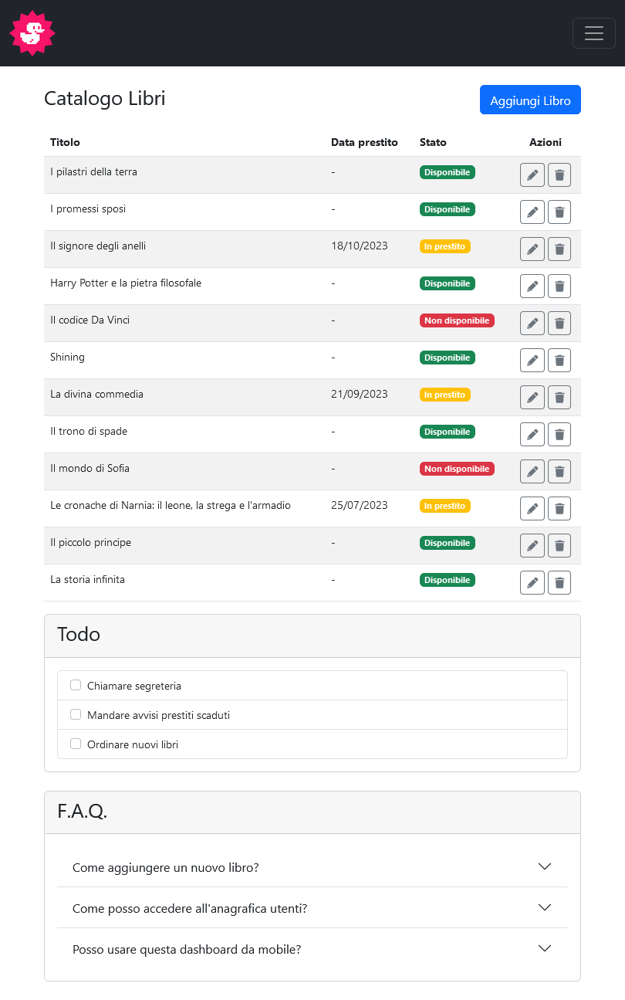
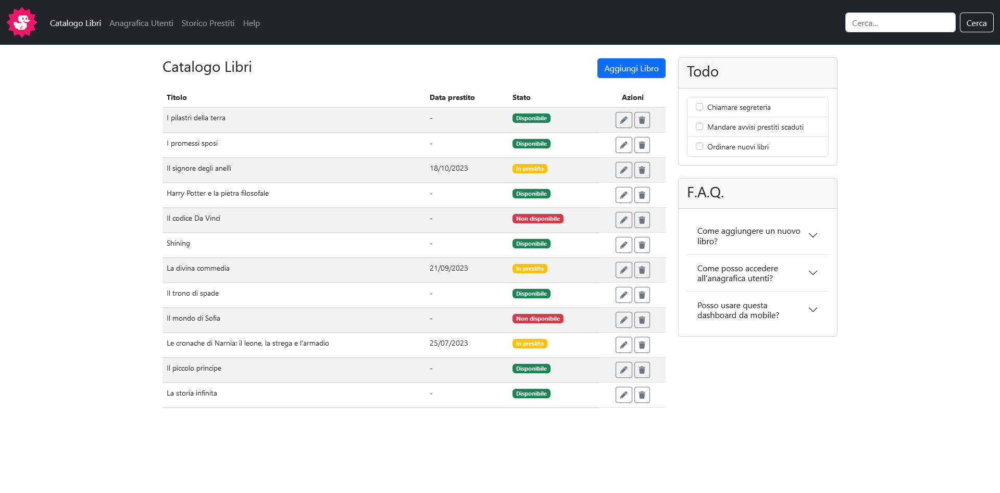

# HTML/CSS Bootstrap Dashboard

> Tip: Technical decisions are summarized in the [Technical Notes](#technical-notes) section

Static responsive layout built for a web development course
exercise using Bootstrap 5 components and utilities.

## Live Demo

[**View on GitHub Pages &nbsp; 🌐**](https://emanuelefavero.github.io/html-css-bootstrap-dashboard/)

## Exercise Goal

Recreate the provided responsive dashboard layout using
Bootstrap 5, matching the reference screenshots across
mobile, tablet and desktop breakpoints while keeping custom
CSS to a minimum.

### Reference layouts

#### Mobile

#### Tablet

#### Desktop

## Scope

- Use HTML and Bootstrap 5
- Recreate the dashboard layout across mobile, tablet and
  desktop resolutions
- Use Bootstrap components, grid system and utility classes as
  the main layout and styling tools
- Keep the page static and focused on layout reproduction
- Use custom CSS only for small utility and accessibility
  refinements where Bootstrap utilities were not enough

## Technical Notes

- Kept the navbar full width and placed the main content inside
  a Bootstrap `container`, with a responsive grid that stacks
  on small screens and splits into `9 / 3` columns on desktop.
- Built the right sidebar with `vstack` and `gap-*` utilities
  so the `Todo` and `F.A.Q.` cards remain vertically stacked at
  every breakpoint.
- Used Bootstrap components directly for the main UI:
  navbar, table, badges, buttons, cards, list group, checks
  and accordion.
- Relied on Bootstrap Icons for the repeated table action
  buttons to keep the markup compact and readable.
- Kept `style.css` intentionally small, using it only for a
  couple of custom utilities such as keyboard-only focus
  styling, a smaller text utility and a minimum width helper
  for the first table column.

&nbsp;

---

&nbsp;

[**Go To Top &nbsp; ⬆️**](#htmlcss-bootstrap-dashboard)
